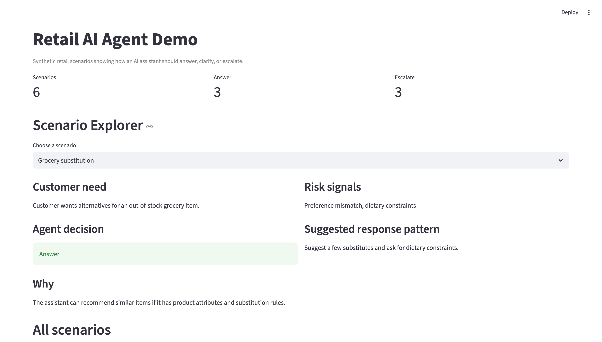

# Retail AI Agent Demo

A synthetic retail AI agent prototype for product leaders.

## Demo



## What this demonstrates
- Retail AI product thinking
- Synthetic-data prototyping
- Assistant workflow design
- Evaluation and launch-readiness mindset
- Product-to-technical translation

## Demo goals
This prototype shows how an AI product manager can design and evaluate a retail assistant before scaling it.

## What is included
- Synthetic customer scenarios
- Simple agent policy map
- Streamlit demo
- Evaluation notes
- Product docs

## Run locally
```bash
python3 -m venv .venv
source .venv/bin/activate
pip install -r requirements.txt
streamlit run app/app.py
```
## Related Projects

This demo follows the evaluation and launch process defined in:

- AI Product Playbook

Quality evaluation can be performed using:

- AI Evaluation Workbench

## Disclaimer
Personal portfolio project using synthetic data only. Not affiliated with or representative of any employer.
