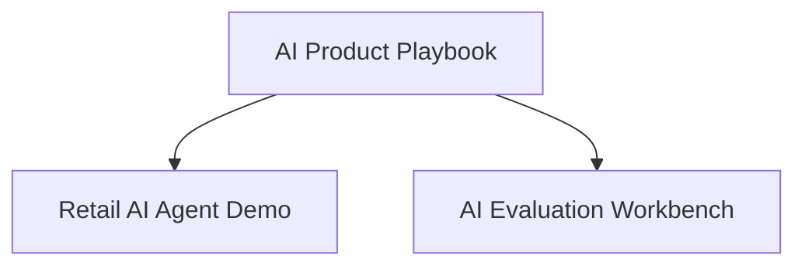

# Retail AI Agent Demo

> A synthetic retail AI assistant that demonstrates how AI Product Managers can prototype, evaluate, and validate customer-facing AI experiences before production.

## Demo


---

## Why This Project Exists

Shipping an AI assistant involves more than connecting an LLM to a chatbot.

Product teams must define customer value, evaluate AI quality, identify failure modes, and determine whether the experience is ready for launch.

This project demonstrates that process using a synthetic retail scenario.

---

## What This Demonstrates

* Designing AI-powered retail experiences
* Rapid prototyping using synthetic customer data
* Customer journey and workflow design
* AI evaluation before launch
* Product thinking beyond prompt engineering

---

## Project Overview

This prototype simulates a retail AI assistant capable of supporting common customer scenarios, including:

* Product discovery
* Returns and refund guidance
* Policy questions
* Order support
* Human escalation

The implementation uses synthetic data and public concepts to demonstrate product thinking without relying on proprietary systems or customer information.

---

## Repository Contents

| Folder      | Purpose                                                        |
| ----------- | -------------------------------------------------------------- |
| **app/**    | Streamlit demo application                                     |
| **data/**   | Synthetic retail scenarios                                     |
| **docs/**   | Product brief, evaluation plan, architecture, and launch notes |
| **assets/** | Demo screenshots and supporting visuals                        |

---

## Running the Demo

```bash
python3 -m venv .venv
source .venv/bin/activate
pip install -r requirements.txt
streamlit run app/app.py
```

---

## Where This Fits

This repository is one implementation within the broader AI Product portfolio.



The development process demonstrated here follows the methodology described in the **AI Product Playbook**, while quality evaluation aligns with the **AI Evaluation Workbench**.

---

## Related Projects

| Repository                                                                        | Purpose                                                                   |
| --------------------------------------------------------------------------------- | ------------------------------------------------------------------------- |
| **[AI Product Playbook](https://github.com/sadasib/ai-product-playbook)**         | Frameworks, templates, and operating models for AI Product Managers.      |
| **[AI Evaluation Workbench](https://github.com/sadasib/ai-evaluation-workbench)** | Evaluate AI quality using synthetic datasets and product-focused metrics. |

---

## Roadmap

Current Version

* Synthetic retail assistant
* Product documentation
* Evaluation artifacts
* Streamlit prototype

Planned Improvements

* Multi-turn customer conversations
* Agentic workflow orchestration
* RAG-enabled product catalog
* Customer satisfaction analytics
* Expanded evaluation scenarios

---

## Disclaimer

This repository is a personal portfolio project created for learning and knowledge sharing.

All scenarios, customer interactions, and datasets are synthetic. Nothing in this repository contains confidential information or represents the views of my employer.
